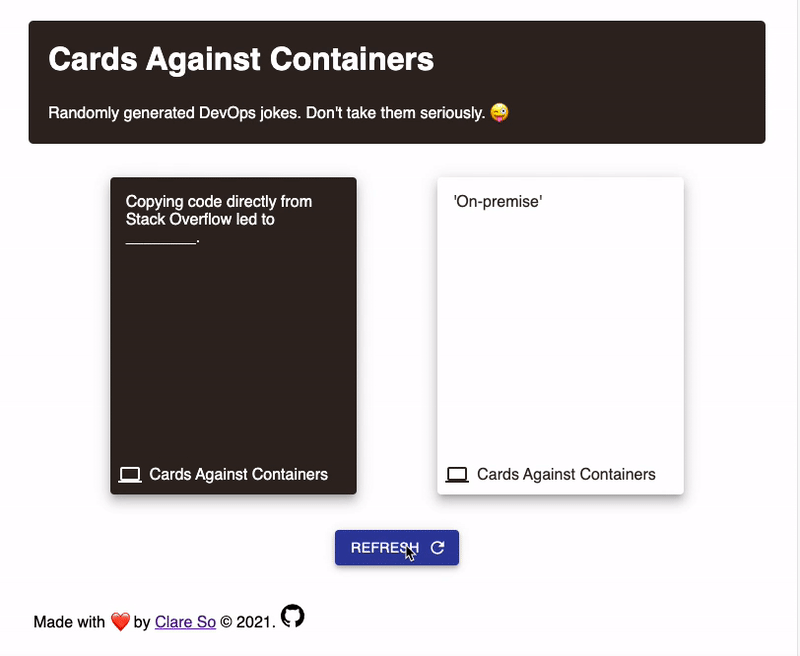

# Cards Against Containers

A web application that displays randomly generated DevOps jokes using the [Cards Against Containers](https://github.com/cardsagainstcontainers/deck) deck.

## Quick Start

Node.js 26 and npm should be installed and configured.

### Run locally

```
npm run develop
```

Then open http://localhost:8000.

### Build

```
npm run build
```

### Deploy

The site is deployed to GitHub Pages automatically when changes are pushed to `main`. To serve a production build locally:

```
npx gatsby serve --prefix-paths
```

Then open http://localhost:9000/cards-against-containers.


