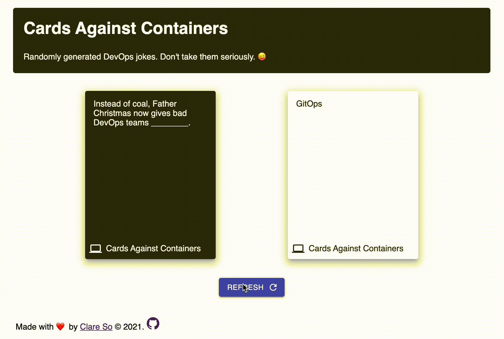

# Web Application for Cards Against Containers

This directory contains the source files for the UI displaying a random question card and a random answer card.

## 🚀 Quick Start

npm should be installed and configured.

### Run webapp locally

`npm start`

### Testing

Unit test (todo)

#### Run end-to-end tests on development build:

`npm test`

#### Run end-to-end tests on production build:

`npm test:ci`

### Deploy

Firebase project has been created. Please see [Google Firebase Documentation](https://firebase.google.com/docs/web/setup) for details.

1. Deploy the REST API.

```
cd ..
gcloud builds submit --config rest-api/cloudbuild.yaml --substitutions=_REGION="us-central1"
```

2. Deploy the UI.

```
cd ..
gcloud build submit --config ui/cloudbuild.yaml .
```

If all goes well, the web application is deployed on `<project name>.web.app`. See https://cards-against-containers.web.app/ for an example.


